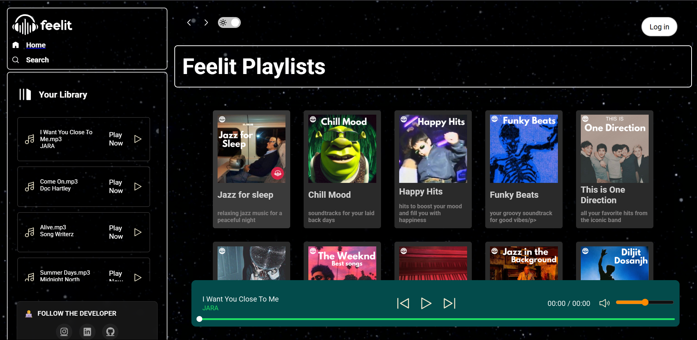
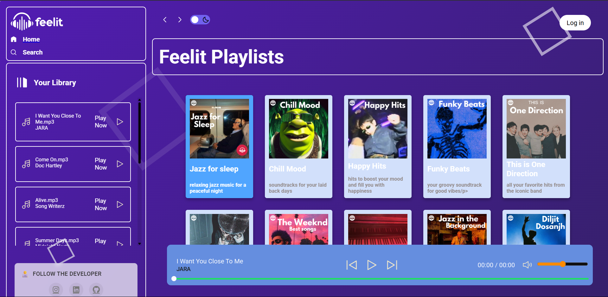

# 🎧 Feelit Music Player

A modern, minimal, and fully responsive web-based music player designed to elevate your listening experience. Feelit offers smooth animations, clean UI, and fast performance — built purely with HTML, CSS, and JavaScript (no frameworks, no fluff).




---

## 🌟 Key Features

- 🎼 **Seamless Playback** — Enjoy uninterrupted music with native HTML5 Audio support.
- 🌓 **Light & Dark Theme Toggle** — Switch themes in a click — your vibe, your style.
- 📱 **Responsive Design** — Flawless experience across desktops, tablets, and smartphones.
- ⚡ **Lightweight & Fast** — Zero dependencies. Just clean, optimized frontend code.
- 🎨 **Glassmorphism UI** — Modern, translucent design with smooth transitions.
- 🔂 **Dynamic Playlist Support** — Easily navigate through a curated set of tracks.

---

## 🧑‍💻 Tech Stack

- **Structure:** HTML5  
- **Styling:** CSS3 (Custom Properties, Animations)  
- **Functionality:** JavaScript (ES6+)  
- **Icons:** Font Awesome  
- **Audio Engine:** HTML5 Audio API  

---

## 🎨 UI/UX Highlights

- Clean and intuitive control panel  
- Animated seek bar and volume slider  
- Hover effects and interactive feedback  
- Smooth theme transitions  
- Customizable via CSS variables  

---

## 🚀 Getting Started

> Clone the repo and run it locally in under a minute.

```bash
git clone https://github.com/yourusername/feelit-music-player.git
cd feelit-music-player

📂 Folder Structure
pgsql
Copy
Edit
feelit-music-player/
├── index.html
├── style.css
├── script.js
├── assets/
│   ├── songs/
│   └── images/
├── screenshots/
└── README.md
📸 Screenshots
Light Theme	Dark Theme
	

💡 Future Plans
✅ Add shuffle and repeat features

📝 Add localStorage support for theme persistence

🎙️ Integrate voice commands (experimental)

🔍 Add search functionality for tracks

📁 Allow drag-n-drop local audio file playback

🙌 Contribute
Pull requests are welcome! If you have feature ideas or design suggestions, feel free to open an issue or fork and improve.

📜 License
This project is licensed under the MIT License — use it freely with attribution.

Made with ❤️ by Shourya Singh

